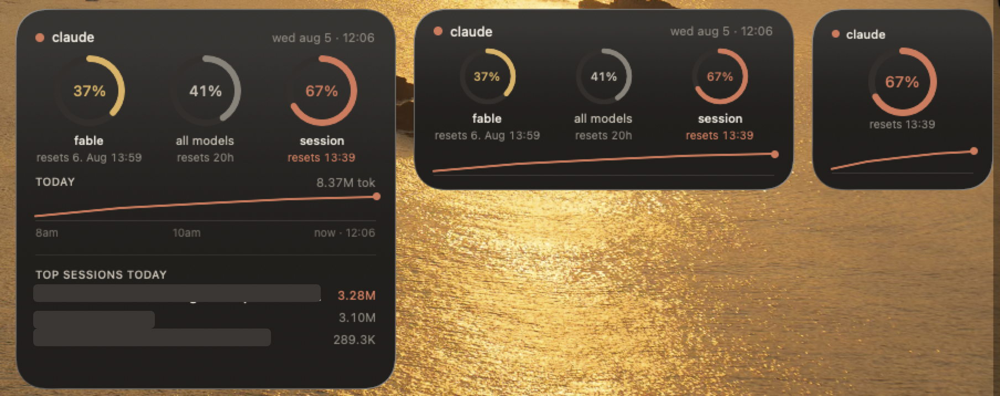

# TokenBurnrate for Claude

A macOS **desktop widget** that shows your Claude Code usage at a glance — session and weekly limits, how fast you're burning through them, and which of your sessions ate the most tokens today.



Every other Claude usage tracker lives in the menu bar. This one sits on your desktop next to Clock and Weather, where you can see it without clicking anything.

## What it shows

**Three wheels — every limit that can cut you off:**
- Fable/Opus weekly limit
- All-models weekly limit
- Current 5-hour session window

Each with its exact reset time ("resets Aug 6 13:59"), pulled from the same source Claude Code's own `/usage` screen uses — not estimates.

**Today:** a live token-burn sparkline with an hourly time axis.

**Top sessions today:** which conversations are eating your budget, ranked. This is the one nobody else has — it turns "I'm at 70%" into "the secret-scan session is why."

**Smart tip** (in the app): notices when one model dominates your burn and suggests dropping to a cheaper one to stretch the week.

## Widget sizes

| Size | Shows |
| --- | --- |
| Small | Session wheel + day trend |
| Medium | All three wheels + day trend |
| Large | Wheels, day trend with time axis, top 3 sessions |

## How it works

The app reads your local Claude Code transcripts in `~/.claude/projects` for per-session and per-model token counts, and runs `claude -p "/usage"` (throttled, at most every 5 minutes) for the official limit percentages. An FSEvents watcher refreshes everything within seconds of any Claude activity.

**Privacy:** the app reads only `~/.claude` and its own cache. No Keychain access, no credentials, no network calls of its own, no personal folders. The widget itself is fully sandboxed and only renders a snapshot the app hands it.

**Performance:** transcripts are append-only, so each refresh parses only the bytes added since last time. Refreshes are milliseconds, not seconds, no matter how heavy your day gets.

## Requirements

- macOS 14+
- Claude Code installed and signed in
- Xcode 15+ and [XcodeGen](https://github.com/yonaskolb/XcodeGen) to build

## Build

```bash
xcodegen generate
xcodebuild -project TokenBurnrate.xcodeproj -scheme TokenBurnrate -configuration Release build
```

Copy the built app to `/Applications` and launch it once, then right-click your desktop → **Edit Widgets** → search "TokenBurnrate".

The app icon is generated from source: `swift Tools/makeicon.swift icon-1024.png`.

## Caveats

This reads undocumented local files and CLI output. If Anthropic changes either, the app degrades gracefully (rings fall back to token-based estimates) but may need an update to show official numbers again.

Not affiliated with Anthropic. "Claude" is a trademark of Anthropic, used here only to describe compatibility.

## License

MIT
